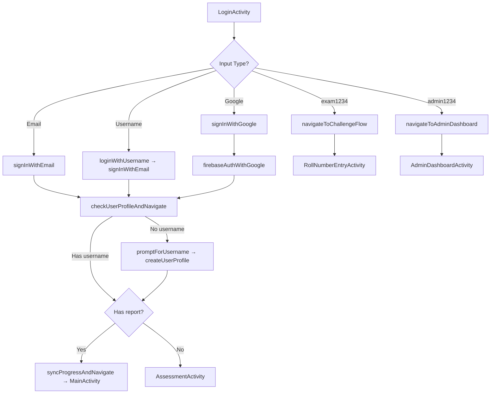

# Authentication Module — UI Documentation

> **Package:** `com.example.embeddedsystemscareerguide.ui.auth`  
> **Files:** `LoginActivity.kt` (894 lines), `RegisterActivity.kt` (351 lines)

---

## LoginActivity.kt

### Purpose
Handles all user authentication: email/password login, username-based login (looks up email from Firestore), Google Sign-In, and special exam/admin credential routing. After authentication, it checks for an existing user profile, prompts new Google users for a username, and routes to the appropriate destination.

### Class Overview

| Element | Type | Role |
|---|---|---|
| `LoginActivity` | `AppCompatActivity` | Main login screen |
| `binding` | `ActivityLoginBinding` | View binding |
| `auth` | `FirebaseAuth` | Firebase authentication |
| `googleSignInClient` | `GoogleSignInClient` | Google Sign-In client |
| `firestore` | `FirebaseFirestore` | Firestore database |
| `USERNAME_PATTERN` | `Regex` (companion) | `^[a-z0-9_]{3,20}$` — validates username format |
| `googleSignInLauncher` | `ActivityResultLauncher` | Handles Google Sign-In result; on success calls `firebaseAuthWithGoogle()`, on error maps `ApiException` status codes to user-friendly messages |

### Lifecycle Flow

```
onStart()
  └─ If user signed in AND has saved username → navigateToIntroduction()

onCreate()
  ├─ Initialize FirebaseAuth & GoogleSignInClient
  ├─ setupUI()
  ├─ setupClickListeners()
  └─ startEntranceAnimations()
```

### All Functions

#### `onCreate(savedInstanceState: Bundle?)` (lines 89–108)
- Inflates binding, initialises Firebase Auth.
- Configures `GoogleSignInOptions` with `DEFAULT_SIGN_IN`, requesting ID token and email.
- Creates `GoogleSignInClient` from the options.
- Calls `setupUI()`, `setupClickListeners()`, `startEntranceAnimations()`.

#### `onStart()` (lines 783–797)
- Auto-login check: if `auth.currentUser != null` **AND** SharedPreferences has a `current_username`, calls `navigateToIntroduction()`.
- If user exists but no saved username, stays on login screen so profile setup can happen.

#### `setupUI()` (lines 110–121)
- Sets status bar colour to `slate_950`.
- Hides the login form card, login button, and Google button (alpha = 0, translationY = offset) for the entrance animation.

#### `setupClickListeners()` (lines 123–149)
- **Login button:** Validates input, then calls `performLogin()`.
- **Google Sign-In button:** Calls `signInWithGoogle()`.
- **Forgot Password text:** Calls `showForgotPasswordDialog()`.
- **Sign Up text:** Navigates to `RegisterActivity` with slide transition.
- Calls `setupButtonAnimations()` at the end.

#### `setupButtonAnimations()` (lines 151–165)
- Adds touch-down/up scale animations (0.95× → 1.0×) to Login and Google Sign-In buttons for tactile feedback.

#### `startEntranceAnimations()` (lines 167–216)
- **Logo:** Scale up 1.1× over 1s, then scale back to 1.0× over 500ms.
- **Title:** Fade in over 800ms, delayed 300ms.
- **Login card:** Fade in + translate to 0 over 800ms, delayed 500ms, with `AccelerateDecelerateInterpolator`.
- **Login button:** Fade in over 600ms, delayed 700ms.
- **Google button:** Fade in over 600ms, delayed 750ms.
- Calls `startFloatingAnimation()`.

#### `startFloatingAnimation()` (lines 218–223)
- Creates an infinite `ObjectAnimator` on the login card: translates Y by 0 → -10 → 0 over 4s, giving a subtle breathing effect.

#### `validateInput(): Boolean` (lines 225–264)
- Clears previous errors.
- If input contains `@`: validates as email using `Patterns.EMAIL_ADDRESS`.
- Otherwise: validates as username against `^[a-z0-9_]{3,20}$`.
- Validates password: not empty, ≥ 6 characters.
- Returns `true` only if all checks pass.

#### `performLogin()` (lines 266–296)
- **Special credentials routing:**
  - `exam1234` / `exam1234` → `navigateToChallengeFlow()`.
  - `admin1234` / `admin1234` → `navigateToAdminDashboard()`.
- If input looks like email (`@`): calls `signInWithEmail(email, password)`.
- Otherwise: calls `loginWithUsername(username, password)`.

#### `navigateToChallengeFlow()` (lines 298–310)
- Signs in with `ChallengeConstants.USER_EMAIL / USER_PASSWORD`.
- On success: calls `navigateToRollNumberEntry()`.
- On failure: calls `createExamUserAndNavigate()`.

#### `createExamUserAndNavigate()` (lines 312–331)
- Creates the exam user via `createUserWithEmailAndPassword`.
- On creation failure: retries sign-in one more time (user might already exist from another attempt).
- On all failures: shows error toast.

#### `navigateToRollNumberEntry()` (lines 333–339)
- Launches `RollNumberEntryActivity` with `CLEAR_TASK` flags.

#### `navigateToAdminDashboard()` (lines 341–358)
- Signs in with `ChallengeConstants.ADMIN_EMAIL / ADMIN_PASSWORD`.
- On success: navigates to `AdminDashboardActivity`.
- On failure: calls `createAdminUserAndNavigate()`.

#### `createAdminUserAndNavigate()` (lines 360–387)
- Mirrors `createExamUserAndNavigate()` but for admin credentials.
- Three-attempt strategy: sign in → create & sign in → retry sign in.

#### `signInWithEmail(email: String, password: String)` (lines 389–400)
- Calls `auth.signInWithEmailAndPassword()`.
- On success: calls `checkUserProfileAndNavigate(user)`.
- On failure: hides loading, shows error.

#### `loginWithUsername(username: String, password: String)` (lines 402–467)
- Launches a coroutine to:
  1. Look up `usernames/{username}` doc in Firestore → get the `uid`.
  2. Look up `users/{username}` doc → get the `email` field.
  3. Call `signInWithEmail(email, password)` on the main thread.
- Handles "username not found", "invalid username data", "no email found" with appropriate errors.
- Uses `Dispatchers.IO` for Firestore calls.

#### `signInWithGoogle()` (lines 469–490)
- Checks Google Play Services availability first; if not available, shows error or resolution dialog.
- Signs out of the Google client (ensures account picker is shown).
- Launches `googleSignInLauncher` with the sign-in intent.

#### `firebaseAuthWithGoogle(acct: GoogleSignInAccount)` (lines 492–504)
- Gets Firebase credential from Google ID token.
- Signs in with `auth.signInWithCredential()`.
- On success: calls `checkUserProfileAndNavigate(user)`.

#### `checkUserProfileAndNavigate(user: FirebaseUser)` (lines 506–565)
- Launches a coroutine with three-layer lookup:
  1. Queries `usernames` collection by `uid` → if found, saves username to prefs, updates `lastLogin`, navigates to `MainActivity`.
  2. Queries `users` collection by `email` → if found, recovers username, syncs `usernames` collection, navigates.
  3. If neither: calls `promptForUsername(user)` — truly new user.

#### `extractUsernameFromEmail(email: String): String` (lines 567–574)
- Takes the local part before `@`, lowercases it, strips non-alphanumeric/underscore chars, truncates to 20 characters.
- Example: `Hello.123@gmail.com` → `hello123`.

#### `promptForUsername(user: FirebaseUser)` (lines 576–637)
- Shows a `MaterialAlertDialog` with a custom layout (`dialog_username_prompt`).
- Pre-fills suggested username from `extractUsernameFromEmail()`.
- On "Continue": validates format, checks Firestore availability, calls `createUserProfile()` if available, then navigates.

#### `createUserProfile(user: FirebaseUser, username: String)` (lines 639–668)
- **Suspend function** using a Firestore batch write:
  1. Creates `usernames/{username}` document with `uid` and `createdAt`.
  2. Creates `users/{username}` document with `uid`, `username`, `email`, `displayName`, `photoUrl`, `createdAt`, `lastLogin`.
- Commits batch, saves username to prefs.

#### `saveUsernameToPrefs(username: String)` (lines 670–675)
- Writes `current_username` to `"user_prefs"` SharedPreferences.

#### `navigateToMainActivity(username: String)` (lines 677–711)
- Checks Firestore for an existing report at `users/{username}/data/report`.
- **Report exists:** Calls `syncProgressAndNavigate(username)`.
- **No report:** Navigates to `AssessmentActivity` (first-time user).
- **Firestore failure:** Falls back to `checkLegacyReportAndNavigate(uid, username)`.

#### `checkLegacyReportAndNavigate(uid: String, username: String)` (lines 713–742)
- Checks old `assessment_reports/{uid}` collection.
- If found: migrates report data and calls `syncProgressAndNavigate()`.
- Otherwise: navigates to `AssessmentActivity`.

#### `migrateReport(reportData: Map<String, Any>?, username: String)` (lines 744–753)
- Copies the report data to `users/{username}/data/report` in Firestore.

#### `syncProgressAndNavigate(username: String)` (lines 802–830)
- Creates `UserProgressSyncService`, loads progress from cloud (no local merge).
- Navigates to `MainActivity` on the UI thread with `CLEAR_TASK` flags.

#### `showLoading()` (lines 755–759)
- Shows `progressBarLogin`, disables Login and Google Sign-In buttons.

#### `hideLoading()` (lines 761–765)
- Hides `progressBarLogin`, re-enables both buttons.

#### `showError(message: String)` (lines 767–769)
- Shows a `Toast.LENGTH_LONG` with the error message.

#### `showSuccess(message: String)` (lines 771–773)
- Shows a `Toast.LENGTH_SHORT` with a success message.

#### `navigateToIntroduction()` (lines 775–781)
- Navigates to `IntroductionActivity` with `CLEAR_TASK` flags and fade transition.

#### `showForgotPasswordDialog()` (lines 835–892)
- Shows a `MaterialAlertDialog` with `dialog_forgot_password` layout.
- Pre-fills email from the login field if it's a valid email.
- On "Send Reset Link": validates email, calls `auth.sendPasswordResetEmail()`.
- Shows success/error dialog after the operation.

### Design Decisions
- **Username-first architecture:** Users are identified by username, not UID — allows human-readable Firestore paths (`users/{username}/data/`).
- **Three-layer profile lookup:** Handles edge cases where the `usernames` collection might be out of sync with `users` (e.g., partial profile creation).
- **Special credential routing:** `exam1234` and `admin1234` bypass normal authentication for challenge/admin flows, with automatic user creation if the Firebase user doesn't exist yet.
- **Auto-login in `onStart()`:** Skips the login screen entirely for returning users who have both a Firebase session and a saved username.
- **Report migration:** Old reports stored under `assessment_reports/{uid}` are automatically migrated to the new `users/{username}/data/report` path.

---

## RegisterActivity.kt

### Purpose
Handles new user registration with real-time username availability checking, email/password validation, and atomic Firestore profile creation.

### Class Overview

| Element | Type | Role |
|---|---|---|
| `RegisterActivity` | `AppCompatActivity` | Registration screen |
| `binding` | `ActivityRegisterBinding` | View binding |
| `auth` | `FirebaseAuth` | For creating the auth user |
| `firestore` | `FirebaseFirestore` | For username/profile storage |
| `usernameCheckJob` | `Job?` | Debounced coroutine for username availability check |
| `isUsernameAvailable` | `Boolean` | Tracks latest availability result |
| `lastCheckedUsername` | `String` | The username that was last successfully checked |
| `USERNAME_PATTERN` | `Regex` (companion) | `^[a-z0-9_]{3,20}$` |

### All Functions

#### `onCreate(savedInstanceState: Bundle?)` (lines 39–54)
- Inflates binding, initialises Firebase Auth.
- Calls `setupUsernameValidation()`.
- Sets Register button click → `registerUser()`.
- Sets "Go to Login" click → navigates to `LoginActivity`.

#### `setupUsernameValidation()` (lines 58–96)
- Adds a `TextWatcher` to the username input:
  - **`beforeTextChanged` / `onTextChanged`:** No-op.
  - **`afterTextChanged`:** Cancels any in-flight check job, validates format against `USERNAME_PATTERN`, shows "⏳ Checking availability..." helper text, then launches a debounced coroutine (600ms delay) calling `checkUsernameAvailability()`.

#### `checkUsernameAvailability(username: String)` (lines 98–193)
- **Suspend function.** First checks network via `isNetworkAvailable()`.
- Reads `usernames/{username}` from Firestore:
  - **Exists:** Shows "❌ Username already taken", sets `isUsernameAvailable = false`.
  - **Not exists:** Shows "✅ Username available", sets `isUsernameAvailable = true`.
- Handles `FirebaseFirestoreException` with specific error code messages:
  - `PERMISSION_DENIED`: Allows registration to proceed (server-side check will catch it).
  - `UNAVAILABLE`: Shows retry prompt.
- On general exceptions: shows "⚠️ Unable to check" with retry.
- Calls `setupRetryClickListener()` on error.

#### `setupRetryClickListener()` (lines 195–208)
- Sets the end icon click listener on the username field to re-trigger `checkUsernameAvailability()`.

#### `isNetworkAvailable(): Boolean` (lines 210–215)
- Uses `ConnectivityManager.getNetworkCapabilities()` to check for internet capability.

#### `registerUser()` (lines 217–349)
- **Validation chain:**
  1. Username: not empty, matches pattern, is available, matches `lastCheckedUsername`.
  2. Email: not empty, valid format.
  3. Password: not empty, ≥ 6 characters.
  4. Confirm password: matches password.
- **Registration flow** (coroutine):
  1. Creates Firebase Auth user with `createUserWithEmailAndPassword()`.
  2. Uses a **Firestore transaction** to atomically:
     - Check if `usernames/{username}` exists.
     - If taken: throws `ABORTED` exception (rolls back, deletes the just-created auth user).
     - If available: claims the username and creates the user profile in one transaction.
  3. On success: shows toast, redirects to `LoginActivity`, calls `finishAffinity()`.
  4. On failure: re-enables the register button, shows error.

### Design Decisions
- **Debounced username check (600ms):** Prevents spamming Firestore with every keystroke.
- **Atomic transaction:** Prevents the race condition where two users submit the same username simultaneously — the Firestore transaction ensures only one succeeds.
- **Auth user cleanup:** If the username transaction fails (someone else claimed it), the just-created Firebase Auth user is deleted to avoid orphaned accounts.
- **Permission-denied resilience:** If Firestore security rules block the read during registration, the app presses the optimistic path and lets the transaction handle conflicts.
- **`lifecycleScope` usage:** Uses lifecycle-scoped coroutines instead of a custom CoroutineScope to prevent memory leaks (H7 fix).

---

## Navigation Flow


