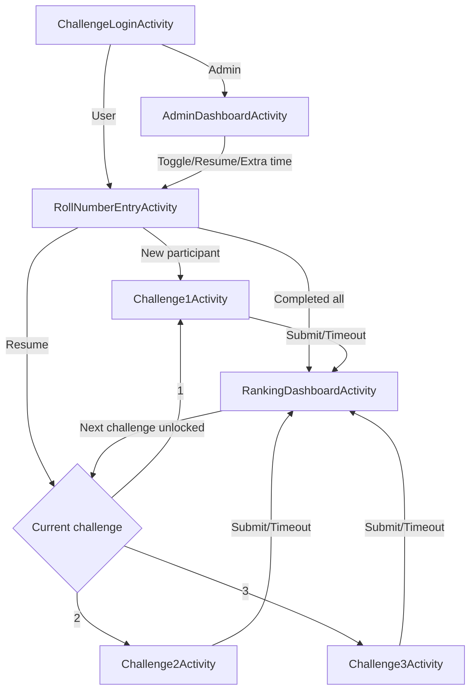

# Challenge Module — UI Documentation

> **Package:** `com.example.embeddedsystemscareerguide.ui.challenge`  
> **Files:** 7 total — `Challenge1Activity.kt` (1,552 lines), `Challenge2Activity.kt` (755 lines), `Challenge3Activity.kt` (779 lines), `ChallengeLoginActivity.kt` (135 lines), `RollNumberEntryActivity.kt` (192 lines), `AdminDashboardActivity.kt` (495 lines), `RankingDashboardActivity.kt` (296 lines)

---

## ChallengeLoginActivity.kt (135 lines)

### Purpose
Handles Firebase Authentication for the Pre-Release Event Challenge. Distinguishes between regular users and admins. Does **not** auto-create accounts on failed sign-in (H-07 security fix).

### Functions
- **`onCreate(savedInstanceState)`** — Inits binding, Firebase Auth, `PreReleaseEventService`. Calls `setupUI()`, `checkEventStatus()`.
- **`setupUI()`** — Login button → `performLogin()`.
- **`checkEventStatus()`** — Queries `eventService.isEventActive()`. Shows green/orange status indicator.
- **`performLogin()`** — Validates email/password inputs. Signs in with Firebase. Routes admin → `navigateToAdmin()`, user → `navigateToRollNumberEntry()`. On failure → shows error (no auto-create).
- **`navigateToRollNumberEntry()`** — Launches `RollNumberEntryActivity`, finishes.
- **`navigateToAdmin()`** — Launches `AdminDashboardActivity`, finishes.
- **`showLoading(show)`** — Toggles progress bar and button state.
- **`showError(message)`** — Shows error text view.
- **`onStart()`** — Auto-login: checks current user, routes by email.

---

## RollNumberEntryActivity.kt (192 lines)

### Purpose
Collects and validates participant's roll number before starting the challenge. Checks Firebase for existing participant status and routes accordingly (resume, next challenge, or new start).

### Functions
- **`onCreate(savedInstanceState)`** — Inits binding, Firebase Auth, `PreReleaseEventService`. Calls `setupUI()`.
- **`setupUI()`** — Sets proceed button → `validateAndProceed()`. Logout button → `logout()`.
- **`validateAndProceed()`** — Validates roll number format against `ChallengeConstants.ROLL_NUMBER_REGEX`. Checks participant status in Firebase:
  - **Terminated:** Shows termination message.
  - **Resumable / In Progress:** Routes to `navigateToChallenge(currentChallenge, isResume=true)`.
  - **Completed current challenge:** Routes to `navigateToRankingDashboard()` or next challenge.
  - **Completed all 3:** Routes to `navigateToRankingDashboard()`.
  - **New:** Registers participant, routes to `navigateToChallenge(1)`.
- **`navigateToChallenge(challengeNumber, rollNumber, isResume)`** — Routes to Challenge1/2/3 Activity based on number, passing roll number and resume flag.
- **`navigateToRankingDashboard(rollNumber)`** — Launches `RankingDashboardActivity` with roll number.
- **`logout()`** — Signs out of Firebase, navigates to `ChallengeLoginActivity`.
- **`showLoading(show)` / `showError(message)`** — UI state helpers.

---

## Challenge1Activity.kt (1,552 lines)

### Purpose
**Easy difficulty** challenge. 3 problems: hardware selection (MCU + components) + drag-drop code blocks. 20-minute timer. Supports resume from saved state.

### Data Classes (imported from `GeminiChallengeService`)
- **`Challenge1Problem`** — `id`, `title`, `description`, `mcuOptions`, `correctMcu`, `components`, `codeBlocks`, `correctOrder`, `problemStatement`.
- **`Challenge1ProblemAnswer`** — `selectedMcu`, `selectedComponents`, `codeBlockOrder`.
- **`CodeBlock`** — `id`, `text`, `category: CodeBlockCategory`, `isDistractor`.
- **`CodeBlockCategory` (enum)** — `INCLUDE`, `DEFINE`, `DECLARATION`, `SETUP`, `LOOP`, `FUNCTION`.

### Local Data Classes
- **`ComponentItem`** — `name`, `type: ComponentType`, `imageKey`.
- **`ComponentType` (enum)** — Values for hardware component categories.

### Adapters
- **`ComponentAdapter`** — RecyclerView adapter for hardware components. Functions: `onCreateViewHolder`, `onBindViewHolder`, `getItemCount`, `clearSelections`, `setSelectedItems`, `getImageFileName(imageKey, type)`.
- **`CodeBlockAdapter`** — RecyclerView adapter for draggable code blocks. Functions: `onCreateViewHolder`, `onBindViewHolder`, `getItemCount`.

### Functions (41 total)
- **Lifecycle:** `onCreate`, `onStop`, `onResume`, `onDestroy`.
- **Setup:** `setupUI` (anti-paste ActionMode callback), `setupBackPressHandler` (H-06: OnBackPressedCallback), `loadBoardImageFromAssets`, `setupComponentRecyclerViews`, `setupCodeBlocksRecyclerView` (ItemTouchHelper for drag-drop).
- **Problem loading:** `loadProblems` (Gemini AI generation + Firebase resume), `serializeProblemsToJson`, `parseProblemsFromJson`.
- **State management:** `serializeCurrentState`, `parseAndRestoreState`, `restoreCurrentProblemFromAnswer`, `updateComponentsUI`.
- **Navigation:** `displayProblem`, `updateProgressDots`, `saveCurrentAnswer`, `loadSavedAnswer`, `reorderCodeBlocksByIds`, `reorderCodeBlocksByContent`, `navigateToProblem`, `selectMcu`.
- **Timer:** `startTimer` (20 min countdown with `timerRunning` guard), `listenForExtraTime` (Firebase RTDB listener, calls `startTimer()`), `updateTimerDisplay`, `updateTimerColor`, `updateProgress`.
- **Submission:** `confirmFinalSubmit`, `showReviewScreen`, `submitChallenge(isTimeout)`, `calculateTimeBonus`, `averageEvaluationResults` (R-02: averages per-problem results + time bonus).
- **Anti-cheat:** `handleAppBackground` (saves state, increments warning count, terminates on 2nd exit), `showTerminationDialog`, `navigateToLogin`, `showWarningDialog`.
- **Error/Loading:** `showGeminiErrorDialog`, `showLoading`, `navigateToRankingDashboard`, `timeoutAndSubmit`.

### Bug Fixes Applied (4)
1. **`timerRunning` flag** — Prevents duplicate timer starts.
2. **`listenForExtraTime` deduplication** — Calls `startTimer()` instead of inline `CountDownTimer`.
3. **`onResume` race condition** — All decisions moved inside coroutine after `warningCount` Firebase sync.
4. **Duplicate listener guard** — `listenForExtraTime()` only called when `!timerRunning`.

---

## Challenge2Activity.kt (755 lines)

### Purpose
**Medium difficulty** challenge. 3 questions: user fills in missing code lines (2–4 lines per blank). 20-minute timer. Supports resume.

### Internal Data
- **`Challenge2QuestionInternal`** — `problemStatement`, `codeTemplate` (with blanks), `expectedSolution`, `userAnswer`.

### Functions (32 total)
- **Lifecycle:** `onCreate`, `onStop`, `onResume`, `onDestroy`.
- **Setup:** `setupUI` (anti-paste ActionMode + custom insert callback), `setupBackPressHandler`, `dispatchKeyEvent` (blocks Ctrl+V paste).
- **Question loading:** `loadQuestions` (Gemini AI + Firebase resume), `serializeQuestionsToJson`, `parseQuestionsFromJson`.
- **Navigation:** `displayQuestion`, `updateProgressDots`, `saveCurrentAnswer`, `navigateToQuestion`.
- **Timer:** `startTimer` (20 min, `timerRunning` guard), `listenForExtraTime` (calls `startTimer()`), `updateTimerDisplay`, `updateTimerColor`, `updateProgress`.
- **Submission:** `confirmFinalSubmit`, `showReviewScreen`, `submitChallenge(isTimeout)`, `calculateTimeBonus`.
- **Anti-cheat:** `handleAppBackground`, `serializeCurrentState`, `parseAndRestoreState`, `showTerminationDialog`, `navigateToLogin`, `showWarningDialog`.
- **Misc:** `showGeminiErrorDialog`, `showLoading`, `navigateToRankingDashboard`, `timeoutAndSubmit`.

### Bug Fixes Applied (11)
Timer logic, extra time handling, background deduction, duplicate listeners, `isSubmitting` guard, score clamping, and more — see walkthrough.

---

## Challenge3Activity.kt (779 lines)

### Purpose
**Hard difficulty** challenge. 3 questions: user writes **complete code from scratch**. 30-minute timer. Supports resume.

### Internal Data
- **`Challenge3QuestionInternal`** — `problemStatement`, `constraints`, `hints`, `expectedSolution`, `userAnswer`.

### Functions (35 total)
- **Lifecycle:** `onCreate`, `onStop`, `onResume`, `onDestroy`.
- **Setup:** `setupUI` (anti-paste + TextWatcher for live line count), `setupBackPressHandler`, `updateLineCount`, `dispatchKeyEvent` (blocks Ctrl+V paste).
- **Question loading:** `loadQuestions` (Gemini AI + Firebase resume), `serializeQuestionsToJson`, `parseQuestionsFromJson`.
- **Navigation:** `displayQuestion`, `updateProgressDots`, `saveCurrentAnswer`, `navigateToQuestion`.
- **Timer:** `startTimer` (30 min, `timerRunning` guard), `listenForExtraTime` (calls `startTimer()`), `updateTimerDisplay`, `updateTimerColor`, `updateProgress`.
- **Submission:** `confirmFinalSubmit`, `showReviewScreen`, `submitChallenge(isTimeout)`, `calculateTimeBonus`.
- **Anti-cheat:** `handleAppBackground`, `serializeCurrentState`, `parseAndRestoreState`, `showTerminationDialog`, `navigateToLogin`, `showWarningDialog`.
- **Misc:** `showGeminiErrorDialog`, `showLoading`, `navigateToRankingDashboard`, `timeoutAndSubmit`.

### Bug Fixes Applied (9)
Timer logic, extra time handling, color helper extraction, score scaling, duplicate listeners, `isSubmitting` guard, and more — see walkthrough.

### Key Differences from Challenge2
- **30-minute timer** (vs 20 for Challenge2).
- **Line counter** — displays real-time line count as user types.
- **Complete code from scratch** — no template/blanks provided.
- **Constraints and hints** — displayed alongside the problem statement.

---

## AdminDashboardActivity.kt (495 lines)

### Purpose
Admin dashboard managing event participants. Toggle challenge access per-user, view/resume sessions, add extra time, view solution details, and export CSV.

### Functions (21 total)
- **Lifecycle:** `onCreate`.
- **Setup:** `setupUI` (TabLayout for All/Active/Completed filters, logout, event toggle, refresh, export CSV).
- **Event:** `checkEventStatus`.
- **Participants:** `observeParticipants` (Flow-based real-time updates), `updateStats` (total, active, completed counts), `applyFilter` (by tab selection).
- **Actions:** `toggleChallenge2(participant, enabled)`, `toggleChallenge3(participant, enabled)`, `confirmDelete(participant)`, `deleteParticipant(participant)`.
- **Resume:** `resumeSession(participant)` (confirms for terminated/timed-out users), `performResumeSession(participant)`.
- **Extra time:** `showAddExtraTimeDialog(participant)` (preset 5/10/15 min options), `showCustomTimeDialog(participant)`, `addExtraTime(participant, minutes)`.
- **Details:** `viewSolutionDetails(participant)` (shows submissions and scores per challenge).
- **Export:** `exportParticipantsCSV()` (generates CSV with roll numbers, scores, and statuses).

### ParticipantsAdapter
RecyclerView adapter for participant cards.
- **ViewHolder** — Holds roll number, status, scores, action buttons.
- **Functions:** `onCreateViewHolder`, `onBindViewHolder` (configures status colours, scores, toggle switches, action buttons), `getItemCount`, `updateData`.

---

## RankingDashboardActivity.kt (296 lines)

### Purpose
Universal leaderboard with real-time updates. Shows all participants' scores sorted by total. Displays challenge unlock notifications via Firebase listener.

### Functions (11 total)
- **Lifecycle:** `onCreate`.
- **Setup:** `setupUI` (back button, retry, "Next Challenge" button).
- **Observers:** `setupRankingsObserver` (Flow `collectLatest` for real-time ranking updates), `setupStatusObserver` (monitors participant's own status for challenge unlocks).
- **Status handling:** `handleStatusUpdate(status)` — detects newly unlocked challenges, shows banners; detects extra time, shows dialog.
- **Notifications:** `showExtraTimeGrantedDialog(challengeNumber, extraMinutes)`, `showChallengeBanner(message, challengeNumber)`.
- **Navigation:** `navigateToChallengeResume(challengeNumber)`, `navigateToNextChallenge` (routes to Challenge1/2/3 based on current progress).
- **Scores:** `loadMyScore` (loads participant's own score from Firebase), `updateMyScoreFromRanking(ranking)` (updates personal score display).

### RankingsAdapter
RecyclerView adapter for leaderboard entries.
- **ViewHolder** — Holds rank, roll number, scores, medal icon.
- **Functions:** `onCreateViewHolder`, `onBindViewHolder` (gold/silver/bronze medals for top 3, rank-based styling), `getItemCount`, `updateData`, `getRankForRollNumber`.

---

## Shared Patterns Across All Challenge Activities

### Anti-Cheat System
All three Challenge activities share:
1. **ActionMode callback** — Blocks copy/paste/cut context menus.
2. **`dispatchKeyEvent`** — Blocks Ctrl+V keyboard shortcuts (Challenge2, Challenge3).
3. **`handleAppBackground`** — On `onStop()`, saves current state to Firebase, increments warning count via atomic transaction, terminates on 2nd exit.
4. **`showWarningDialog` / `showTerminationDialog`** — Display appropriate messages.
5. **`isSubmitting` guard** in `onStop()` — Prevents background handling during active submission.

### Timer System
1. **`CountDownTimer`** with `timerRunning` flag to prevent duplicate starts. `onTick` updates display + color (red at <1 min, orange at <5 min). `onFinish` auto-submits.
2. **`listenForExtraTime`** — Firebase Realtime Database `ValueEventListener` that detects admin-granted extra time, calls `startTimer()` to restart with additional time. **Guarded** so listener is only registered once.
3. **`updateTimerColor`** — Extracted helper for timer color transitions.
4. **`calculateTimeBonus`** — Awards up to 20 bonus points for finishing early.
5. **Background time deduction** — Uses `SystemClock.elapsedRealtime()` to accurately deduct time spent in background.

### Question/Problem Flow
1. **Gemini AI generation** — Questions generated on first start via `GeminiChallengeService`.
2. **Firebase resume** — Saved state loaded from participant's Firebase Realtime Database document.
3. **Serialization** — JSON-based state serialization for save/restore (questions + answers + selections).
4. **Evaluation** — Per-problem evaluation via `GeminiChallengeService.evaluateChallenge*()`, with server-side score enforcement and clamping.
5. **Submission** — Handled by `PreReleaseEventService.submitChallenge1/2/3()` which stores submissions, evaluations, and updates rankings.

### Scoring System

| Challenge | Weight | Max Raw | Max Weighted | Timer |
|---|---|---|---|---|
| Challenge 1 (Easy) | 1.0x | 100 | 100 | 20 min |
| Challenge 2 (Medium) | 1.5x | 100 | 150 | 20 min |
| Challenge 3 (Hard) | 2.0x | 100 | 200 | 30 min |
| **Total** | — | — | **450** | — |

**Evaluation Categories** (6 total, 100 raw points):

| Category | Max Score | What It Measures |
|---|---|---|
| Attempt Completeness | 20 | How complete is the attempt? |
| Syntax Correctness | 20 | Code syntactically valid? |
| Logic Accuracy | 25 | Does logic solve the problem? |
| Critical Elements | 15 | Essential components present? |
| Code Quality | 10 | Organization, naming, efficiency |
| Error Count | 10 | 0 errors=10, 1-2=7, 3-4=4, 5+=0 |

### Architecture Flow

