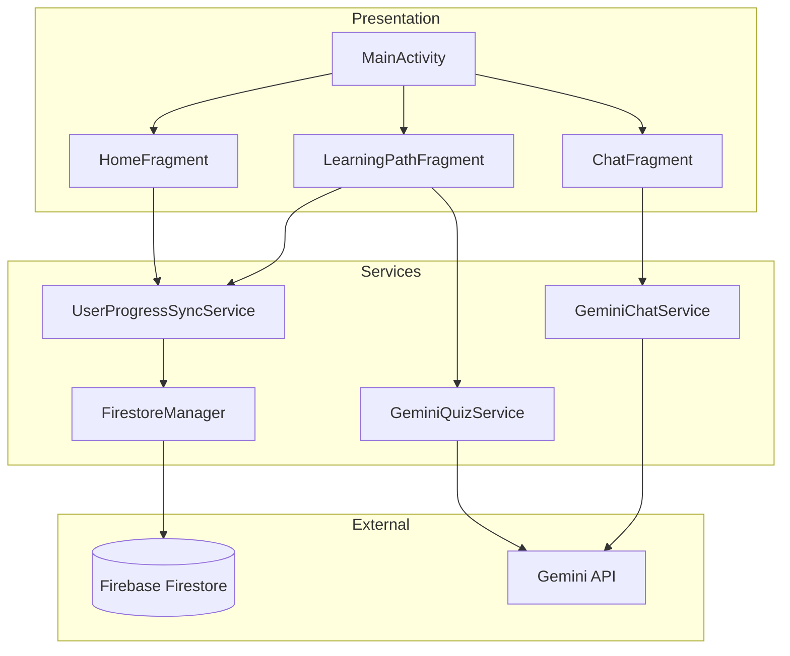

# System Architecture

## Overview

The Embedded Systems Career Guide follows a **clean architecture** pattern with three distinct layers:

1. **Presentation Layer** - UI components (Fragments, Activities)
2. **Service Layer** - Business logic and API communication
3. **Data Layer** - Firebase Firestore as single source of truth

## Architecture Principles

### Cloud-Only Data Storage

> [!IMPORTANT]
> All user progress is stored **exclusively in Firebase Firestore**.
> No local SharedPreferences are used for progress data.

This ensures:
- Data persistence across devices
- No data loss on app reinstall
- Consistent state synchronization

### MVVM Pattern

```
┌─────────────┐      ┌─────────────┐      ┌─────────────┐
│    View     │◄────►│  ViewModel  │◄────►│   Service   │
│ (Fragment)  │      │             │      │             │
└─────────────┘      └─────────────┘      └─────────────┘
```

- **View**: Displays data, handles user input
- **ViewModel**: Manages UI state, survives config changes
- **Service**: Handles business logic, API calls

## Component Relationships



## Data Models

### UserProgress
```kotlin
data class UserProgress(
    val totalXP: Int,
    val currentStage: Int,
    val streak: Int,
    val bestStreak: Int,
    val lastVisitDate: String,
    val completedStages: List<String>,
    val stageStars: Map<String, Int>,
    val lastUpdated: Long
)
```

### LearningStage
```kotlin
data class LearningStage(
    val id: Int,
    val title: String,
    val description: String,
    val difficulty: Difficulty,
    val xpReward: Int,
    val lessonContent: LessonContent,
    val isCompleted: Boolean,
    val starsEarned: Int
)
```

## Service Responsibilities

| Service | Responsibility |
|---------|----------------|
| `UserProgressSyncService` | Cloud progress CRUD |
| `GeminiQuizService` | AI quiz generation |
| `GeminiChatService` | AI chat responses |
| `GeminiReportService` | Assessment reports |
| `FirestoreManager` | Firestore operations |
| `StageContentService` | Learning content |

## Design Decisions

### Why Cloud-Only?
- **Consistency**: Single source of truth prevents sync conflicts
- **Persistence**: Progress survives app reinstall
- **Cross-device**: Same progress on multiple devices

### Why Gemini API?
- **Dynamic content**: Fresh quiz questions every time
- **Personalization**: Tailored to user's progress
- **Cost-effective**: Free tier sufficient for app usage

### Why Firebase?
- **Real-time sync**: Instant updates
- **Authentication**: Google Sign-In integration
- **Scalability**: Handles growth automatically
