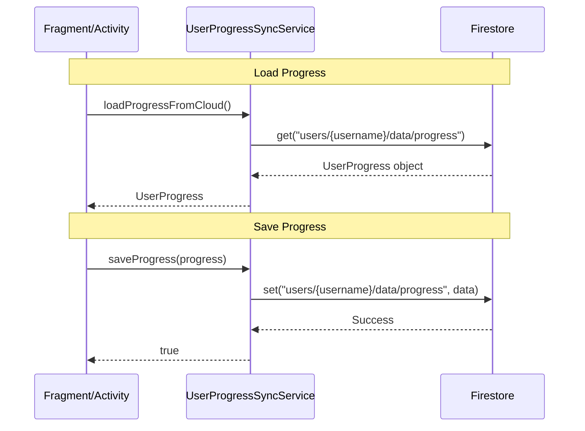

# Data Flow Architecture

## Cloud-Only Architecture

> [!IMPORTANT]
> All user progress is stored **exclusively in Firebase Firestore**.
> No local SharedPreferences for progress data.

## Data Flow Diagram



## Progress Data Structure

```kotlin
data class UserProgress(
    val totalXP: Int,           // Cumulative XP
    val currentStage: Int,      // Active stage (1-16)
    val streak: Int,            // Current streak
    val bestStreak: Int,        // All-time best
    val lastVisitDate: String,  // YYYY-MM-DD
    val completedStages: List<String>,  // ["1", "2", "3"]
    val stageStars: Map<String, Int>,   // {"1": 3, "2": 2}
    val lastUpdated: Long       // Timestamp
)
```

## Firestore Document Path

```
/users/{username}/data/progress
```

## Data Operations

### Read Operations

| Operation | Method | When Called |
|-----------|--------|-------------|
| Load Progress | `loadProgressFromCloud()` | Fragment onViewCreated, onResume |
| Check Report | Document exists check | HomeFragment assessment button |

### Write Operations

| Operation | Method | Trigger |
|-----------|--------|---------|
| Complete Stage | `completeStageInCloud()` | Quiz completion |
| Update Stars | `updateStarsInCloud()` | Quiz retake |
| Update Streak | `updateStreakInCloud()` | Daily login |
| Save Progress | `saveProgress()` | Any progress change |

## No Local Storage For Progress

**Allowed SharedPreferences:**
- `user_prefs.current_username` - Session identifier

**NOT Allowed:**
- ❌ XP in local storage
- ❌ Streak in local storage
- ❌ Completed stages locally
- ❌ Assessment flags locally

## Pull-to-Refresh

HomeFragment supports pull-to-refresh for manual cloud sync:

```kotlin
binding.swipeRefreshLayout.setOnRefreshListener {
    loadProgressFromCloud()
}
```
