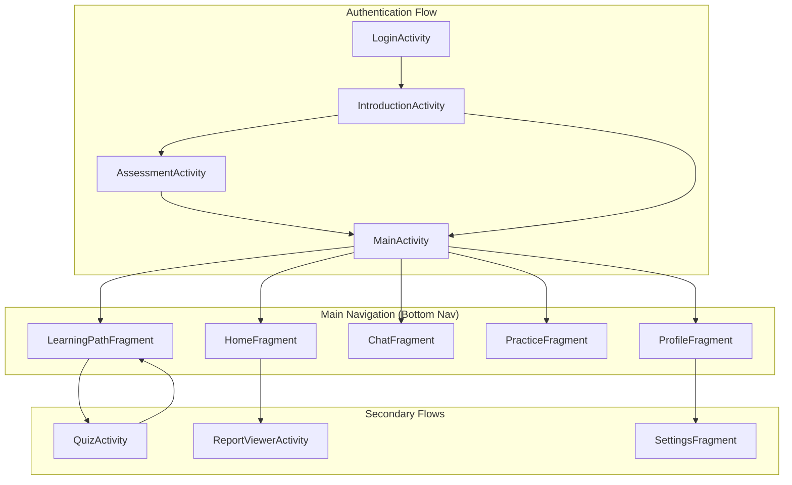

# Navigation Flow

## App Navigation Architecture

The app uses **Jetpack Navigation** with a single `NavHostFragment` in `MainActivity`.

## Navigation Graph



## Bottom Navigation Destinations

| Item | Fragment | Icon |
|------|----------|------|
| Home | HomeFragment | 🏠 |
| Learn | LearningPathFragment | 📚 |
| Chat | ChatFragment | 💬 |
| Practice | PracticeFragment | 🎯 |
| Profile | ProfileFragment | 👤 |

## Deep Links

Currently not implemented. Potential additions:
- `app://stage/{stageId}` - Open specific stage
- `app://chat` - Open chat tutor

## Back Stack Management

```kotlin
// Home selected as root, prevents back stack buildup
navController.navigate(R.id.nav_home) {
    popUpTo(R.id.nav_home) { inclusive = true }
}
```

## Activity Stack

```
LoginActivity
    └── IntroductionActivity (finishes after)
        └── AssessmentActivity (optional, finishes after)
            └── MainActivity (main host)
                └── QuizActivity (result returns to Learning)
                └── ReportViewerActivity (overlay)
```

## Navigation Files

| File | Purpose |
|------|---------|
| `nav_graph.xml` | Main navigation graph |
| `menu_bottom_nav.xml` | Bottom navigation items |
| `menu_drawer.xml` | Drawer navigation items |
