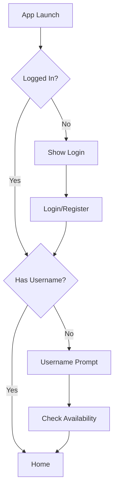

# LoginActivity.kt

> **Location**: `app/src/main/java/com/example/embeddedsystemscareerguide/ui/auth/LoginActivity.kt`

## Purpose

Handles **user authentication** via email/password and Google Sign-In. Manages user session and username registration.

## Size

**~30KB** - Complex authentication flow.

## Features

| Feature | Description |
|---------|-------------|
| Email Login | Traditional email/password auth |
| Google Sign-In | One-tap Google authentication |
| Username Registration | Unique username prompt after first login |
| Password Reset | Forgot password flow |
| Auto-login | Session persistence check |

## Authentication Flow



## Firebase Integration

```kotlin
// Email login
auth.signInWithEmailAndPassword(email, password)

// Google Sign-In
val signInRequest = BeginSignInRequest.builder()
    .setGoogleIdTokenRequestOptions(...)
    .build()
```

## Username System

```kotlin
// Username stored in Firestore
firestore.collection("users")
    .document(username)
    .set(userData)

// Also cached in SharedPreferences for session
prefs.edit().putString("current_username", username).apply()
```

## Why It's Important

1. **Security**: Firebase Auth handles credentials
2. **Identity**: Username for cloud data paths
3. **UX**: Google Sign-In for convenience
4. **Session**: Persistent login state

## Strengths

- ✅ Multiple auth methods
- ✅ Username uniqueness validation
- ✅ Proper error handling
- ✅ Password visibility toggle

## Weaknesses

- ⚠️ Large file - needs refactoring
- ⚠️ Some deprecated local storage usage
- ⚠️ No biometric authentication
- ⚠️ No email verification

## Potential Improvements

1. **Add biometric login** option
2. **Implement email verification**
3. **Extract to AuthViewModel**
4. **Add rate limiting** for login attempts

---

# AssessmentActivity.kt

> **Location**: `app/src/main/java/com/example/embeddedsystemscareerguide/ui/assessment/AssessmentActivity.kt`

## Purpose

Initial **skill assessment** quiz with 10 questions. Generates personalized report using Gemini AI.

## Flow

```
Start → 10 Questions → Submit → AI Report Generation → Save to Cloud → View Report
```

## Report Generation

Uses `GeminiReportService` to create personalized HTML report with:
- Question-by-question feedback
- Skill analysis
- 12-week learning roadmap

## Report Storage

```kotlin
// Reports saved to Firestore
firestore.collection("users")
    .document(username)
    .collection("data")
    .document("report")
    .set(reportData)
```

---

# IntroductionActivity.kt

Splash screen with assessment check - navigates to main app if report exists.

---

# ReportViewerActivity.kt

WebView-based viewer for HTML assessment reports stored in Firestore.
